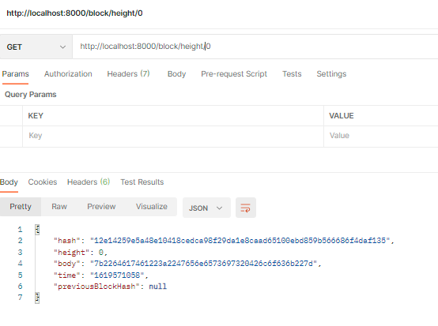
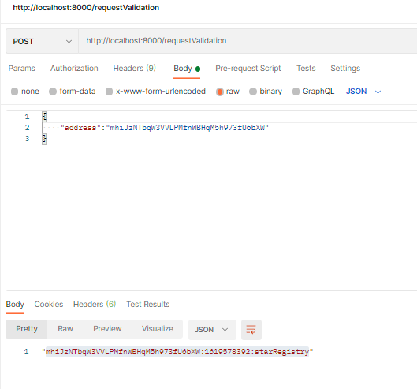
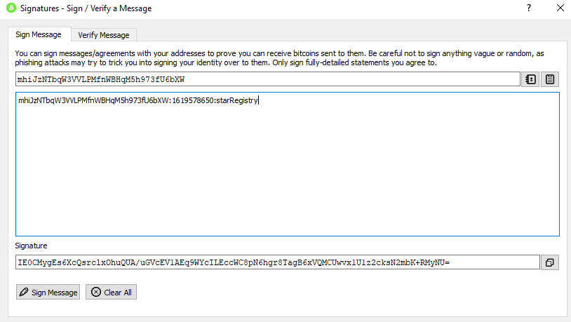
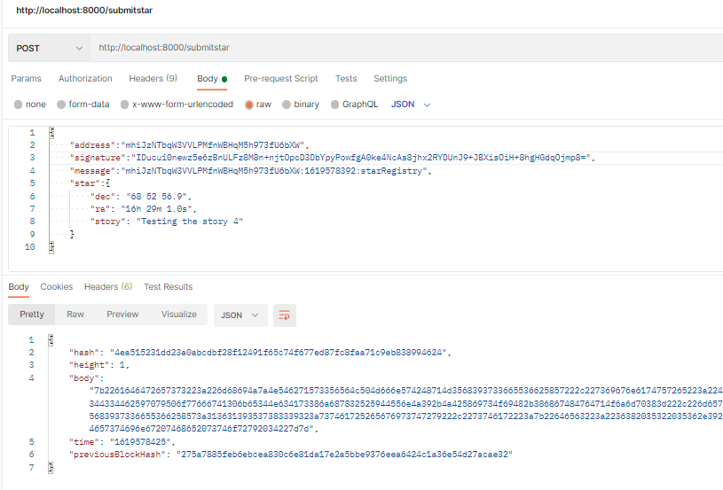
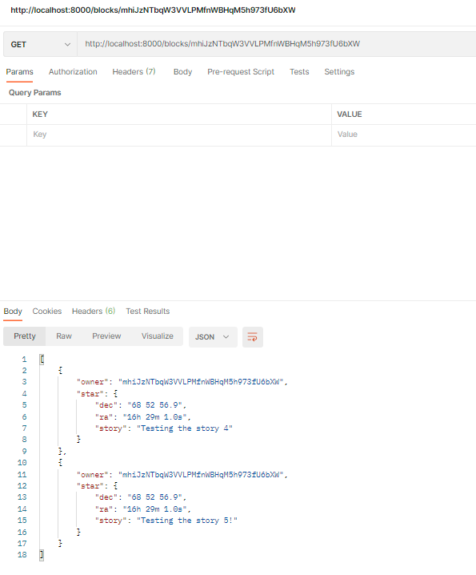

# Private Blockchain Application

This project allows to demonstrate the fundamentals concepts of a Blockchain platform.
Concepts like:
    - Block
    - Blockchain
    - Wallet
    - Blockchain Identity
    - Proof of Existence


### Specs of the project

1. The application creates a Genesis Block when we run the application.
2. The user requests the application to send a message to be signed using a Wallet and in this way verify the ownership over the wallet address. The message format is: `<WALLET_ADRESS>:${new Date().getTime().toString().slice(0,-3)}:starRegistry`;
3. Once the user have the message the user can use a Wallet to sign the message.
4. The user then tries to submit the Star object for that it will submit: `wallet address`, `message`, `signature` and the `star` object with the star information.
    The Start information is formed in this format:
    ```json
        "star": {
            "dec": "68° 52' 56.9",
            "ra": "16h 29m 1.0s",
            "story": "Testing the story 4"
		}
    ```
5. The application verifies if the time elapsed from the request ownership (the time is contained in the message) and the time when the user submits the star is less than 5 minutes.
6. If everything is okay the star information is then stored in the block and added to the `chain`
7. The application allows us to retrieve the Star objects that belong to an owner (wallet address). 


## What tools or technologies are used to create this application?

- This application has been created using Node.js and Javascript programming language. The architecture uses ES6 classes
because it will help us to organize the code and facilitate the maintnance of the code.
- Some of the libraries used are:
    - "bitcoinjs-lib": "^4.0.3",
    - "bitcoinjs-message": "^2.0.0",
    - "body-parser": "^1.18.3",
    - "crypto-js": "^3.1.9-1",
    - "express": "^4.16.4",
    - "hex2ascii": "0.0.3",
    - "morgan": "^1.9.1"    

Libraries purpose:

1. `bitcoinjs-lib` and `bitcoinjs-message`. Those libraries will help us to verify the wallet address ownership, we are going to use it to verify the signature.
2. `express` The REST Api created for the purpose of this project it is being created using Express.js framework.
3. `body-parser` this library will be used as middleware module for Express and will help us to read the json data submitted in a POST request.
4. `crypto-js` This module contain some of the most important cryotographic methods and will help us to create the block hash.
5. `hex2ascii` This library will help us to **decode** the data saved in the body of a Block.

## Run the application

Run the application using the command `node app.js`
You should see in your terminal a message indicating that the server is listening in port 8000:
> Server Listening for port: 8000

Below are a few example requests with screenshots
1. Check the Genesis Block
    
2. Make your first request of ownership sending your wallet address:
    
3. Sign the message with your Wallet (here we used Bitcoin Core):
    
4. Submit your Star
     
5. Retrieve Stars owned by me
    